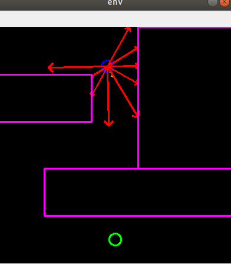
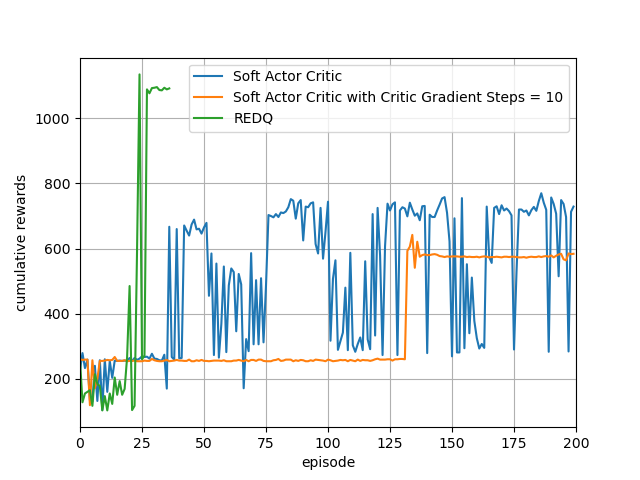

# REDQ simple example

## 2D vehicle control learning examples

### Environment
- [x] Unicycle model
- [x] Lidar-like sensor model

- Observation : 9 range distance measurement values
    - maximum distance : 10m
    - angle range : [-120 deg, 120 deg]
    - minmax normalized to [0, 1]

- Action : angular velocity
    - action range : [-pi/4 rad/s, pi/4 rad/s]

- Linear velocity
    - train : 3m/s, constant
    - test : 1.5m/s, constant

- screen shot  

### Reinforcement learning algorithm 
- [x] Soft Actor Critic
- [x] Randomized Ensembled Double Q learning

### Results

### Reference
- [2D vehicle Env](https://github.com/MorvanZhou/Reinforcement-learning-with-tensorflow)
- [REDQ another implementation](https://github.com/BY571/Randomized-Ensembled-Double-Q-learning-REDQ-)