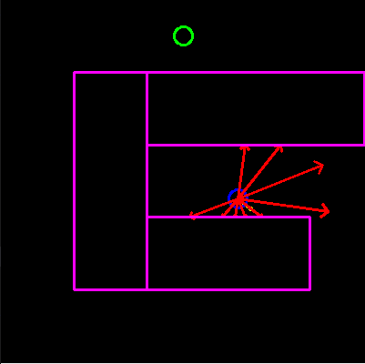
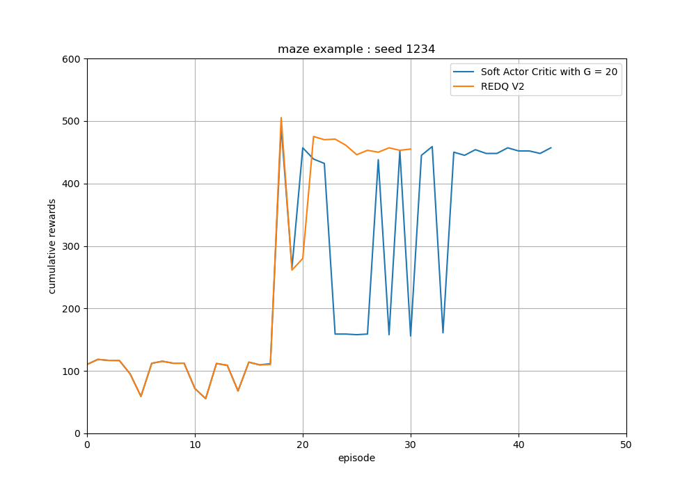

# REDQ simple example

## 2D vehicle control learning examples with REDQ

### Reinforcement learning algorithm 
- [x] Soft Actor Critic (SAC)
    - [x] able to tune an update-to-date (UTD) ratio G
- [x] Randomized Ensembled Double Q learning (REDQ)

### Environment
- [x] Unicycle model
- [x] Lidar-like sensor model

- Task : reach the goal point with the green circle while avoiding the collision with walls

- Observation : 9 range distance measurement values
    - maximum distance : 10m
    - angle range : [-120 deg, 120 deg]
    - minmax normalized to [0, 1]

- Action : angular velocity
    - action range : [-pi/4 rad/s, pi/4 rad/s]

- Linear velocity
    - train : 3m/s, constant
    - test : 1.5m/s, constant

- Reward
    - -5 if collisions happens
    - 2 * clip(distance measure, 0, 0.5) 

- screen shot  

### Results

- Early stop the training process when the agent reaches the target for 10 consecutive episodes.

### Reference
- [2D vehicle Env](https://github.com/MorvanZhou/Reinforcement-learning-with-tensorflow)
- [REDQ paper](https://arxiv.org/abs/2101.05982)
- [REDQ another implementation](https://github.com/BY571/Randomized-Ensembled-Double-Q-learning-REDQ-)