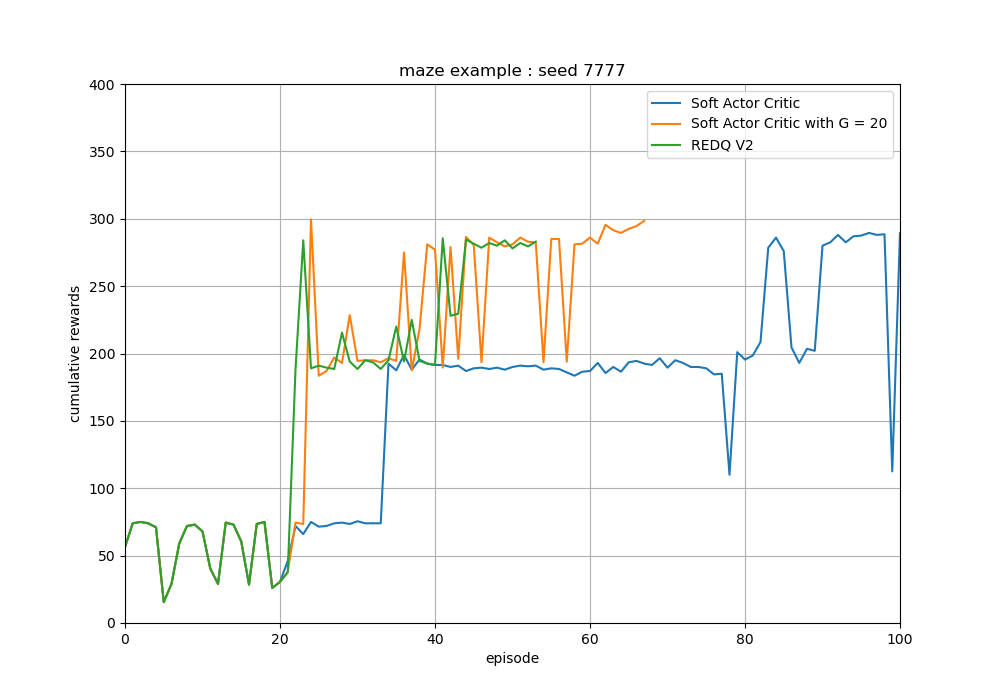

# REDQ simple example

## 2D vehicle control learning examples with REDQ

### Reinforcement learning algorithm

- Agent
    - [x] Soft Actor Critic (SAC)
        - [x] able to tune an update-to-data (UTD) ratio G
    - [x] Randomized Ensembled Double Q learning (REDQ)
        - [x] v1 : N critics and N critic optimizers
        - [x] v2 : N critics and 1 critic optimizer
- ETC
    - [x] multi-step Q learning

### Environment
- [x] Unicycle model
- [x] Lidar-like sensor model

- Task : reach the goal point with the green circle while avoiding the collision with walls

- Observation : different direction scan measurement values
    - the default number of scan value N : 9
    - maximum distance : 10m
    - historical window length H : H consecutive observations are concatenated with the shape (1, N*H)
    - angle range : [-120 deg, 120 deg]
    - minmax normalized to [0, 1]
    - [x] add gaussian sensor noise : 0.2

- Action : angular velocity
    - action range : [-pi/4 rad/s, pi/4 rad/s]

- Linear velocity
    - train : 3m/s, constant
    - test : 1.5m/s, constant

- Disturbance
    - zero mean gaussian noise with std 0.3 for linear velocities
    - zero mean gaussian noise with std 0.1 for angular velocities

- Reward
    - -5 if collisions happens
    - 0.5 if forward distance measure > 5 else 0 

- screen shot  

### Train the agent

- Soft actor critic
    - After the training of REDQ, the parameters of the agent are saved in the directory `/maze_example/savefile/sac` 
    or `/maze_example/savefile/sac_g20`
~~~
cd REDQ_simple_example
python /maze_example/train_sac_agent.py --max_train_eps 100
~~~
~~~
python /maze_example/train_sac_agent.py --max_train_eps 100 --G 20
~~~

- REDQ
    - After the training of REDQ, the parameters of the agent are saved in the directory `/maze_example/savefile/redq` 
    or `/maze_example/savefile/redq_v2`
~~~
cd REDQ_simple_example
python /maze_example/train_redq_agent.py --max_train_eps 100 --version v2
~~~

### Results

- Early stop the training process when the agent reaches the target for 10 consecutive episodes.
- In the complex environments, the performance gap between SAC-G and REDQ might widen further

### Reference
- [2D vehicle Env](https://github.com/MorvanZhou/Reinforcement-learning-with-tensorflow)
- [REDQ paper](https://arxiv.org/abs/2101.05982)
- [REDQ pytorch implementation](https://github.com/BY571/Randomized-Ensembled-Double-Q-learning-REDQ-)